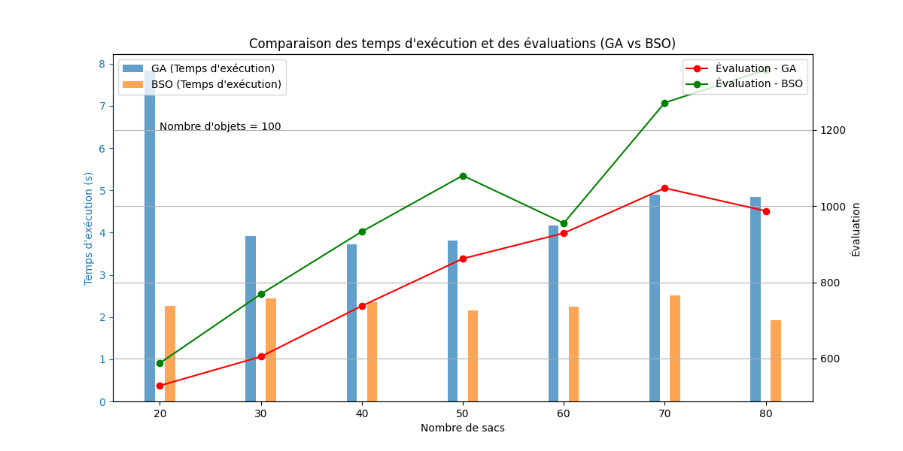

# Problème du sac à dos multiple : recherche exacte et métaheuristiques

Projet du module *Métaheuristiques et algorithmes évolutionnaires* (Master 1 SII, USTHB, 2023–2024), encadré par Naila Houacine. On range des objets (valeur, poids) dans plusieurs sacs de capacités différentes pour **maximiser la valeur totale**, et on compare deux familles d'approches dans une application Java Swing.

Une solution est un vecteur `sol[i] ∈ {-1, 0, …, nb_sacs-1}` : le sac attribué à l'objet `i`, ou `-1` s'il n'est pas pris.

## Approches implémentées

**Partie 1 — recherche dans l'espace d'états** (`SacADosMultiple.java`)
- Parcours en profondeur (DFS) et en largeur (BFS).
- **A\*** avec trois heuristiques au choix :
  1. rapport entre la valeur des objets restants et la capacité restante des sacs ;
  2. relaxation linéaire (remplissage fractionnaire des capacités restantes) ;
  3. valeur placée pénalisée par le déséquilibre de charge entre les sacs.

**Partie 2 — métaheuristiques**
- **Algorithme génétique** (`GA.java`, `Genetique.java`, `Solution.java`) : population bornée et triée (`PrioritySet`), sélection des meilleurs individus, croisement en un point, mutation par réaffectation d'un objet, rejet des individus non valides, arrêt sur stagnation.
- **Bee Swarm Optimization** (`BSO.java`) : solution de référence, zones de recherche obtenues par inversion de bits (`flip`), recherche locale de chaque abeille, table taboue, danse, puis choix de la meilleure solution par qualité ou par diversité, avec un nombre de chances limité.

**Interface** (`SacADosGUI.java`) : saisie ou génération aléatoire d'une instance, choix de l'algorithme et de ses paramètres, affichage de la solution, de sa valeur, du temps de calcul et du nombre de nœuds développés.

## Résultats

**Recherche exacte, 7 objets** (nœuds développés et temps selon le nombre de sacs) :

| Sacs | A\* : nœuds | A\* : temps | BFS : nœuds | BFS : temps | DFS : temps |
|---:|---:|---:|---:|---:|---:|
| 3 | 372 | 0,02 s | 8 826 | 0,5 s | 0,6 s |
| 5 | 825 | 0,09 s | 212 380 | 594 s | 440 s |
| 7 | 2 508 | **3,5 s** | 2 403 898 | 58 346 s (16 h) | 41 926 s (11,6 h) |

L'heuristique réduit l'exploration de trois ordres de grandeur. La recherche aveugle devient impraticable au-delà de quelques sacs.

**Métaheuristiques, 100 objets** (valeur obtenue et temps selon le nombre de sacs) :

| Sacs | GA : valeur | GA : temps | BSO : valeur | BSO : temps |
|---:|---:|---:|---:|---:|
| 20 | 529 | 7,8 s | **588** | 2,3 s |
| 40 | 738 | 3,7 s | **933** | 2,4 s |
| 60 | 929 | 4,2 s | **955** | 2,2 s |
| 80 | 987 | 4,8 s | **1 357** | 1,9 s |



Quand le nombre de sacs augmente, BSO donne de meilleures solutions que l'algorithme génétique à chaque taille testée, en 1,5 à 3,5 fois moins de temps. Quand on fait varier le nombre d'objets avec 20 sacs, les deux algorithmes sont proches en valeur ([`results/results_sac.txt`](results/results_sac.txt)), et BSO reste plus rapide. L'étude de sensibilité des paramètres (taille de population, probabilité de mutation, facteur de sélection, nombre d'abeilles, `flip`, itérations locales, chances) est dans [`figures/`](figures) et [`results/`](results).

## Lancer

Nécessite Java 21 ou plus récent.

```bash
javac -encoding UTF-8 -d out src/*.java
java -cp out SacADosGUI          # interface graphique
java -cp out Experimentation     # campagne GA contre BSO (écrit results_obj.txt)
```

## Documents

- [Rapport partie 1 — recherche aveugle et A\*](docs/rapport_partie1_recherche.pdf)
- [Rapport partie 2 — algorithme génétique et BSO](docs/rapport_partie2_metaheuristiques.pdf)

## Licence

Code distribué sous [licence MIT](LICENSE).

## Auteur

**Amar Merabti** — Master 1 SII, USTHB.
